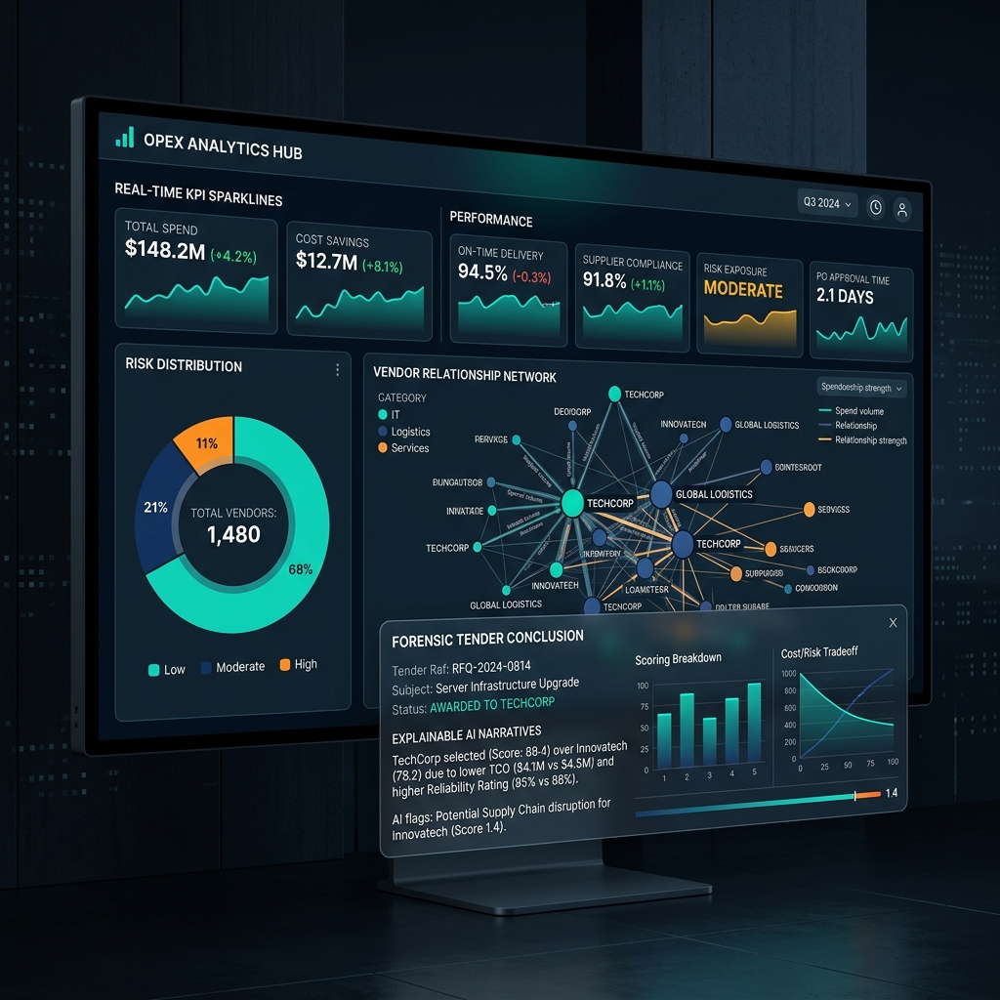

<p align="center">
  
</p>

# 🔍 TenderLens AI: Enterprise Procurement Intelligence

### _Unmasking Corruption with Predictive Analytics_

[](https://reactjs.org/)
[](https://vitejs.dev/)
[](https://tailwindcss.com/)
[](https://www.python.org/)
[](https://lucide.dev/)

**TenderLens AI** is a production-grade, high-density decision intelligence dashboard designed for government auditors and enterprise procurement teams. It transforms raw bidding data into actionable risk signals using multi-dimensional AI scoring, network analysis, and statistical anomaly detection.

---

## 🌐 Website Features & Interface

### 🖥️ High-Density Decision Dashboard
The core interface provides a multi-layered view of procurement health, featuring real-time KPI sparklines and risk distribution visualizers.

<p align="center">
  
</p>

### ✨ Key Capabilities

#### 📊 Executive Intelligence Dashboard
- **Real-time KPI Sparklines** — Track Total Tenders, High Risk escalations, and Fairness Indices with live-updating sparklines and trend indicators.
- **Risk Distribution Engine** — Visual breakdown of Low, Medium, and High-risk tenders using animated Recharts.
- **Departmental Heatmapping** — Identify which ministries or business units have the highest frequency of irregularities.

#### 🕸️ Autonomous Vendor Network Graph
- **Relationship Mapping** — Force-directed graph on HTML5 Canvas mapping co-bidding patterns.
- **Collusion Detection** — Automatically flags "Red Edge" relationships between vendors with high co-participation rates and statistically impossible bid clustering.
- **Vendor Risk Profiles** — Deep-dive side panels showing vendor history, Win/Loss ratios, and associated risk vectors.

#### 💰 AI Price Intelligence
- **Fair Price Prediction** — Statistical model predicting "Fair Market Value" vs actual bids to identify extreme over-pricing or predatory under-pricing.
- **Anomaly Scatter Plot** — Interactive visualization of thousands of bids to find outliers (Z-Score > 2.5).
- **Cartel Clustering** — Detects suspiciously tight bid spreads (CV < 1%) indicative of bid-rigging.

#### 📋 Forensic Tender Conclusion
- **Explainable AI Narratives** — Natural language risk explanations (e.g., "Dominant winner pattern detected in 'Health' category").
- **Audit-Ready Gauges** — Performance gauges for Fairness and Market Concentration (HHI).
- **One-Click Decisioning** — AI-driven 'Approve', 'Further Review', or 'Reject' recommendations.

---

## 🏗️ Technical Architecture

| Layer | Technology |
| :--- | :--- |
| **Frontend** | React 18, Vite |
| **Styling** | Tailwind CSS (Custom Dark Theme, Glassmorphism) |
| **Data Viz** | Recharts, Headless Canvas API (Network Graph) |
| **Icons** | Lucide-React |
| **State** | React Context API |
| **Backbone** | Python (Analytics Engine) |

---

## 🚀 Getting Started

### Prerequisites
- **Node.js 18+**
- **Python 3.10+**
- **npm** or **yarn**

### Local Setup

1. **Clone the repository**
   ```bash
   git clone https://github.com/jananikuppan04-sys/tenderlens-ai.git
   cd tenderlens-ai
   ```

2. **Frontend Installation**
   ```bash
   cd frontend
   npm install
   npm run dev
   ```

3. **Backend Analytics (Optional)**
   ```bash
   cd ..
   pip install -r requirements.txt
   streamlit run app.py
   ```

---

## 🌍 Deployment

### **Frontend (Vercel/Netlify)**
The frontend is optimized for **Vercel**.
1. Connect your GitHub repo to Vercel.
2. The `Build Command` is `npm run build`.
3. The `Output Directory` is `dist`.

---

## 🤝 Roadmap & Startup Vision
- [ ] **Live API Integration**: Connect to Government e-Marketplace (GeM) via REST hooks.
- [ ] **Blockchain Audit Log**: Store all "Tender Conclusions" on a private chain for immutable audit trails.
- [ ] **NLP Report Generator**: Automated PDF generation for legal investigations.

---
<p align="center">
  <b>Built for Global Transparency & Procurement Fairness</b><br>
  <sub>TenderLens AI — v2.1.0</sub>
</p>